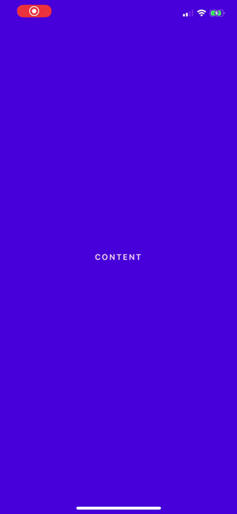
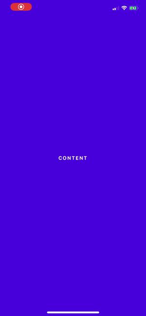
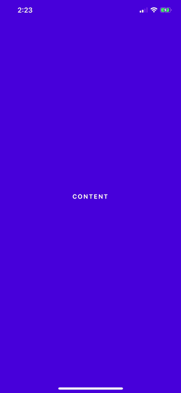
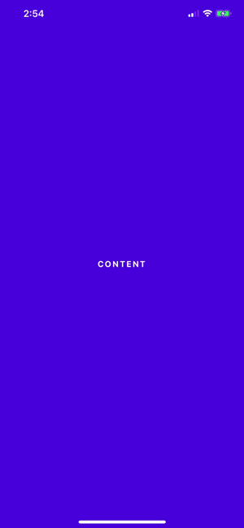
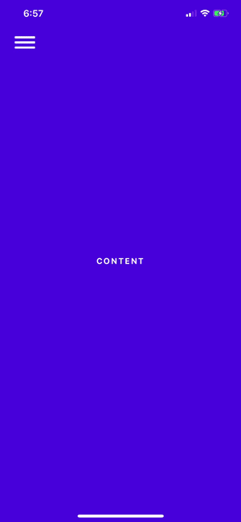
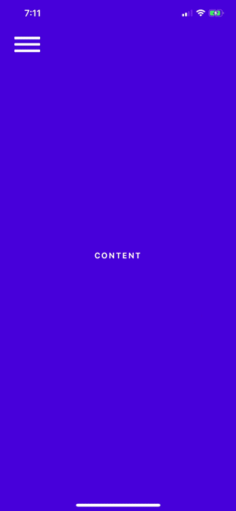
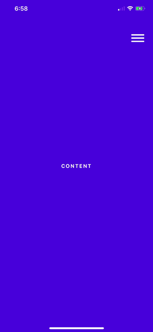
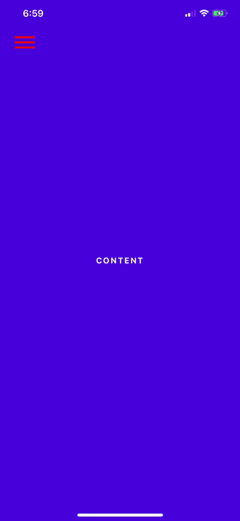
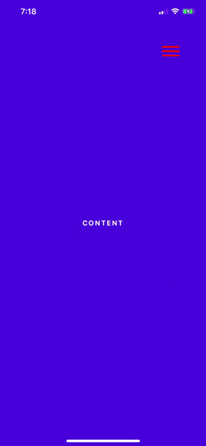

<p align="center">
  A simple animated menu for React Native apps.
</p>

# react-native-side-nav


[](https://npmjs.org/package/react-native-side-nav)
[](http://makeapullrequest.com)
[](https://npmjs.org/package/react-native-side-nav)
[](https://opensource.org/licenses/MIT)

## Changelogs

- **[2.0.0]**
  - Added burgerIcon

## Contents

- [Contents](#contents)
- [Usage](#usage)
- [Props](#props)
- [Examples](#examples)
- [Roadmap](#roadmap)

## Usage

#### Class Component

```jsx
import React from "react";
import { View, TouchableOpacity } from "react-native";
import SideMenu from "react-native-side-nav";

class App extends React.Component {
  constructor(props) {
    super(props);
    this.state = {
      menuExpanded: false
    };
  }

  toggleMenu = () => {
    this.setState({ menuExpanded: !this.state.menuExpanded });
  };

  menuComponent = () => {
    return (
      <View>
        <TouchableOpacity onPress={this.toggleMenu}>
          // Your close button
        </TouchableOpacity>
        // Your menu content
      </View>
    );
  };

  render() {
    return (
      <View>
        <SideMenu
          menuExpanded={this.state.menuExpanded}
          menuComponent={this.menuComponent()}
          burgerIcon={true}
          onPress={this.toggleMenu}
        >
          // Your App components
        </SideMenu>
      </View>
    );
  }
}

export default App;
```

#### Using Hooks

```jsx
import React from "react";
import { View, TouchableOpacity } from "react-native";
import SideMenu from "react-native-side-nav";

const App = () => {
  const [menuExpanded, setMenuExpanded] = useState(false);

  toggleMenu = () => {
    setMenuExpanded(!menuExpanded);
  };

  menuComponent = () => {
    return (
      <View style={styles.animatedBox}>
        <TouchableOpacity onPress={toggleMenu}>
          // Your close button
        </TouchableOpacity>
        // Your menu content
      </View>
    );
  };

  return (
    <View>
      <SideMenu
        menuExpanded={this.state.menuExpanded}
        menuComponent={this.menuComponent()}
        burgerIcon={true}
        onPress={toggleMenu}
      >
        // Your App components
      </SideMenu>
    </View>
  );
};

export default App;
```

## Props

| Prop                                    |  Default  |   Type   | Description                                                                                                                                                                                         |
| :-------------------------------------- | :-------: | :------: | :-------------------------------------------------------------------------------------------------------------------------------------------------------------------------------------------------- |
| menuExpanded                            |   false   |  `bool`  | Set to `true` to open the menu.                                                                                                                                                                     |
| menuComponent()                         |           | `object` | The content of your drawer. (see example)                                                                                                                                                           |
| menuWidth _optional_                    |    80     | `number` | The width of the menu, as a percentage of the screen width.                                                                                                                                         |
| animationDuration _optional_            |    300    | `number` | The length of the animation in ms.                                                                                                                                                                  |
| fade _optional_                         |   false   |  `bool`  | Set to `true` to make the menu fade in on top of the content. Only works if `push` is set to `false`.                                                                                               |
| overlay _optional_                      |   false   |  `bool`  | Set to `true` adds a dark overlay on top of the app when the menu is open.                                                                                                                          |
| overlayOpacity _optional_               |    0.4    | `number` | Sets the opacity of the overlay.                                                                                                                                                                    |
| leftAligned _optional_                  |   false   |  `bool`  | Set to `true` to make the menu come in from the left side of the screen.                                                                                                                            |
| push _optional_                         |   false   |  `bool`  | Set to `true` to make the menu 'push' the app contents to one side.                                                                                                                                 |
| burgerIcon _optional_                   |   false   |  `bool`  | Set to `true` to add an absolutely positioned burger icon to toggle your menu.                                                                                                                      |
| onPress _required if burgerIcon={true}_ |   false   |          | Your toggle function for the burger icon.                                                                                                                                                           |
| burgerWidth _optional_                  |    35     | `number` | The width of the burger icon.                                                                                                                                                                       |
| burgerIconStyles _optional_             |    {}     | `object` | Edit the burger X and Y position. Example: `burgerIconStyles={{top: 30, left: 20}}`. You can try passing other styles although they haven't been tested. Use the burger icon color props instead.   |
| burgerIconColor1 _optional_             | '#ffffff' | `string` | The color you want your burger icon to be.                                                                                                                                                          |
| burgerIconColor2 _optional_             |    ''     | `string` | If the background of your menu doesn't match the rest of your app, you can change the color of the icon when the menu is expanded. If you don't set this value it will default to burgerIconColor1. |

## Examples

#### menuWidth

<div >
	
</div>

#### fade

<div >
	
</div>

#### overlay & overlayOpacity

<div >
	
</div>

#### leftAligned

<div >
	
</div>

#### push

<div >
	
</div>

#### burgerIcon

<div >
	
</div>

#### burgerWidth

<div >
	
</div>

#### burgerIconStyles

<div >
	
</div>

#### burgerIconColor1

<div >
	
</div>

#### burgerIconColor2

<div >
	
</div>

## Roadmap

- [ ] Improve animation
- [ ] Android support
- [x] Add burger icon
- [x] Testing
- [x] Add overlay opacity prop

## Questions

Feel free to [contact me](mailto:serena.antonetti@gmail.com) or [create an issue](https://github.com/serenastorm/react-native-side-nav/issues/new)

> Inspired by [leecade/react-native-swiper](https://github.com/leecade/react-native-swiper/) & made with ♥.
