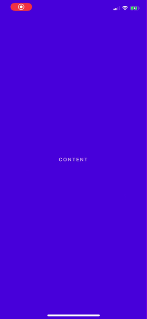

<p align="center">
  A simple animated menu for React Native apps.
</p>

# react-native-side-nav


[](https://npmjs.org/package/react-native-side-nav)
[](http://makeapullrequest.com)
[](https://npmjs.org/package/react-native-side-nav)
[](https://opensource.org/licenses/MIT)

## Contents

- [Contents](#contents)
- [Usage](#usage)
- [Props](#props)
- [Examples](#examples)
- [Roadmap](#roadmap)

## Usage

#### Class Component

```jsx
import React from "react";
import { View, TouchableOpacity } from "react-native";
import SideMenu from "react-native-side-nav";

class App extends React.Component {
  constructor(props) {
    super(props);
    this.state = {
      menuExpanded: false
    };
  }

  toggleMenu = () => {
    this.setState({ menuExpanded: !this.state.menuExpanded });
  };

  menuComponent = () => {
    return (
      <View>
        <TouchableOpacity onPress={this.toggleMenu}>
          // Your close button
        </TouchableOpacity>
        // Your menu content
      </View>
    );
  };

  render() {
    return (
      <View>
        <SideMenu
          menuExpanded={this.state.menuExpanded}
          menuComponent={this.menuComponent()}
        >
        // Your App components
        </SideMenu>
      </View>
    );
  }
};

export default App;
```

#### Using Hooks

```jsx
import React from "react";
import { View, TouchableOpacity } from "react-native";
import SideMenu from "react-native-side-nav";

const App = () => {
  const [menuExpanded, setMenuExpanded] = useState(false);

  toggleMenu = () => {
    setMenuExpanded(!menuExpanded);
  };

  menuComponent = () => {
    return (
      <View style={styles.animatedBox}>
        <TouchableOpacity onPress={toggleMenu}>
          // Your close button
        </TouchableOpacity>
        // Your menu content
      </View>
    );
  };

  return (
    <View>
      <SideMenu
        menuExpanded={this.state.menuExpanded}
        menuComponent={this.menuComponent()}
      >
        // Your App components
      </SideMenu>
    </View>
  );
};

export default App;
```

## Props

| Prop              | Default |   Type   | Description                                                                                           |
| :---------------- | :-----: | :------: | :---------------------------------------------------------------------------------------------------- |
| isExpanded        |  false  |  `bool`  | Set to `true` to open the menu.                                                                       |
| menuWidth         |   80    | `number` | The width of the menu, as a percentage of the screen width.                                           |
| animationDuration |   300   | `number` | The length of the animation in ms.                                                                    |
| fade              |  false  |  `bool`  | Set to `true` to make the menu fade in on top of the content. Only works if `push` is set to `false`. |
| overlay           |  false  |  `bool`  | Set to `true` adds a dark overlay on top of the app when the menu is open.                            |
| overlayOpacity    |   0.4   | `number` | Sets the opacity of the overlay.                                                                      |
| leftAligned       |  false  |  `bool`  | Set to `true` to make the menu come in from the left side of the screen.                              |
| push              |  false  |  `bool`  | Set to `true` to make the menu 'push' the app contents to one side.                                   |

## Examples

#### menuWidth

<div >
	
</div>

#### fade

<div >
	
</div>

#### overlay & overlayOpacity

<div >
	
</div>

#### leftAligned

<div >
	
</div>

#### push

<div >
	
</div>

## Roadmap

- [ ] Add burger icon
- [ ] Improve animation
- [ ] Android support
- [X] Testing
- [X] Add overlay opacity prop

## Questions

Feel free to [contact me](mailto:serena.antonetti@gmail.com) or [create an issue](https://github.com/serenastorm/react-native-side-nav/issues/new)

> Inspired by [leecade/react-native-swiper](https://github.com/leecade/react-native-swiper/) & made with ♥.
